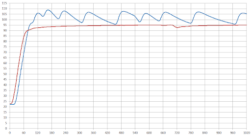

# Temperatura no Espresso - PID vs Termostato
2020-07-27 11-57
> tags: #coffee #espresso

> references:
---
Em geral, a maior parte das máquinas de espresso domésticas fazem a gestão da temperatura de operação do boiler (considerando as que não usam termobloco ou outras tecnologias diferentes de boilers) a partir de um termostado. O termostato permite de o boiler seja ligado ou desligado de acordo com determinada temperatura.

Quando a máquina liga o boiler começa a aquecer a água até uma determinada temperatura seja medida pelo termostato. Nesse momento o boiler é desligado e a água entra em um processo lento de resfriamento. Quando uma determinada temperatura mínima é percebida pelo termostato o boiler é acionado novamente, inicando o processo de aquecimento da água até que ela atinja novamente a temperatura "máxima", onde ocorrerá seu desligamento.

Entretanto, a grande variação  de temperatura de operação da máquina de espresso é um problema comum que pode prejudicar os resultados produzidos. Uma forma de minimizar essas variações no resultado é fazendo o surfe de temperatura. Porém, apesar do sufe de temperatura produzir uma mesma temperatura de operação, ele não permite escolher qual é essa temperatura de arbitrária.

Para solucionar esse problema, uma modificação comum nas máquinas de expresso com boiler é a instalação de um PID (algumas máquinas já vem com o PID de fábrica).

O PID é um dispositivo que se conecta no boiler e nos pontos de controle da máquina de espresso e permite regular a temperatura de trabalho com grande precisão. Este dispositivo faz um papel minuicioso de controle, garantindo uma consistência na temperatura sem depender das estratégias de surfe.

A figura representa a comparação entre a variação de temperatura em uma máquina de esperesso utilizando o termostado e o PID. A linha azul é a temperatura com termostato e a linha vermelha é a temperatura com o PID.

---
Links:
>   - 